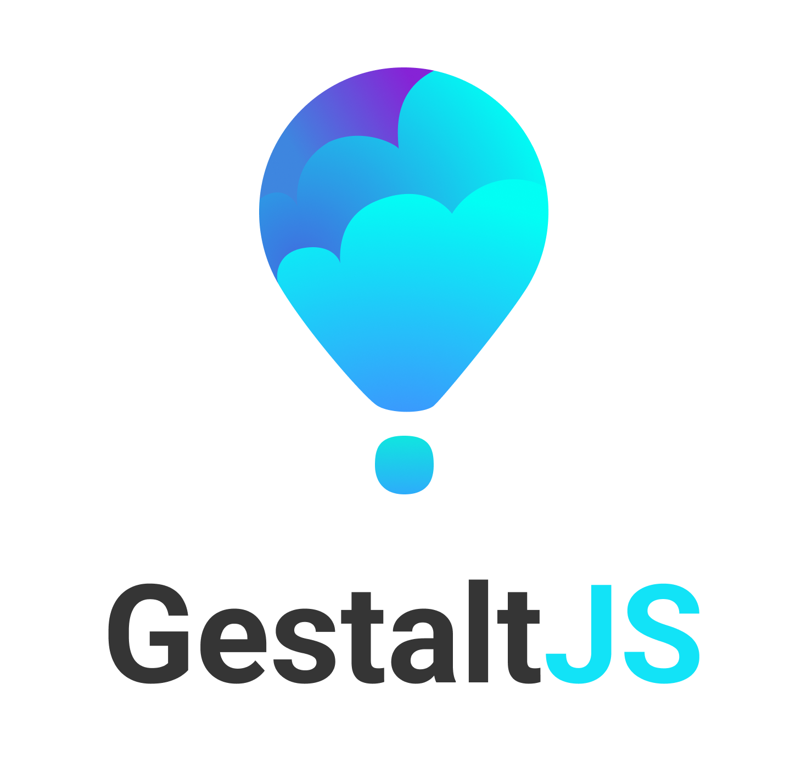

<div align="center">
  
  <br/>
  <a href="https://gitpod.io/#https://github.com/gestaltjs/gestalt" alt="Open in Gitpod"></a>
  <br/>
  
  
  
  
  
  <a href="http://twitter.com/gestaltjs"></a>
  
  <a href="#contributors-"></a>
  <a href="https://tuple.app"></a>
</div>

Gestalt is a modern opinionated and batteries-included [NodeJS](https://nodejs.org/en/) framework for building digital experiences with web technologies. It's designed to spark joy through convenient abstractions and workflows that [conceptually compress](https://m.signalvnoise.com/conceptual-compression-means-beginners-dont-need-to-know-sql-hallelujah/) the intricacies of building apps.

## Projects

| Project              | Description     | CI                                                                                                                                                  | URL |
| -------------------- | --------------- | -------------------------------------------------------------------------------------------------------------------------------------------------- | ---  |
| [gestalt](/packages/gestaltjs) | The Gestalt CLI | [](https://github.com/gestaltjs/gestalt/actions/workflows/gestalt.yml) | |
| [website](/packages/website) | The Gestalt Website |  | [gestaltjs.org](https://gestaltjs.org) |

## Usage

You can create a new Gestalt project by running any of the following commands:

```bash
npx @gestaltjs/create-project@latest
```

## Development

### Set up

- Clone the repository: `https://github.com/gestaltjs/gestalt.git`.
- Install System dependencies: `npm install -g pnpm`
- Install dependencies: `pnpm install`.
- Run Gestalt: `pnpm gestalt`.
- Run create-project: `pnpm create-project`.

### System dependencies

- [pnpm](https://pnpm.io/)
- [shadowenv](https://shopify.github.io/shadowenv/)

## Core team ✨

<!-- prettier-ignore-start -->
<!-- markdownlint-disable -->
<table>
  <tr>
    <td align="center"><a href="https://rbarbadillo.github.io/"><br /><sub><b>Raquel Barbadillo</b></sub></a><br /><a href="https://github.com/gestaltjs/gestalt/commits?author=rbarbadillo" title="Code">💻</a></td>
    <td align="center"><a href="http://craftweg.com"><br /><sub><b>Pedro Piñera Buendía</b></sub></a><br /><a href="https://github.com/gestaltjs/gestalt/commits?author=pepicrft" title="Code">💻</a></td>
    <td align="center"><a href="https://github.com/lascenify"><br /><sub><b>Ascen Salmerón Ibáñez</b></sub></a><br /><a href="https://github.com/gestaltjs/gestalt/commits?author=lascenify" title="Code">💻</a></td>
    <td align="center"><a href="http://josemasar.vercel.app"><br /><sub><b>Josema Sar</b></sub></a><br /><a href="https://github.com/gestaltjs/gestalt/commits?author=josemasar" title="Code">💻</a></td>
    <td align="center"><a href="http://LNSD.es"><br /><sub><b>Lorenzo Delgado</b></sub></a><br /><a href="https://github.com/gestaltjs/gestalt/commits?author=LNSD" title="Code">💻</a></td>
    <td align="center"><a href="http://www.fernandocejas.com/"><br /><sub><b>Fernando Cejas</b></sub></a><br /><a href="https://github.com/gestaltjs/gestalt/commits?author=android10" title="Code">💻</a></td>
  </tr>
</table>

<!-- markdownlint-restore -->
<!-- prettier-ignore-end -->

## Contributors ✨

Thanks goes to these wonderful people ([emoji key](https://allcontributors.org/docs/en/emoji-key)):

<!-- ALL-CONTRIBUTORS-LIST:START - Do not remove or modify this section -->
<!-- ALL-CONTRIBUTORS-LIST:END -->

This project follows the [all-contributors](https://github.com/all-contributors/all-contributors) specification. Contributions of any kind welcome!
