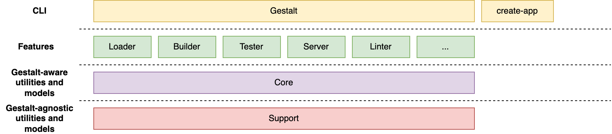

# Architecture

GestaltJS follows a **modular architecture** to make the code easier to maintain and contribute to.
Modules,
which we represent and distribute as NPM packages,
have well-defined responsibilities and clear boundaries (APIs) that abstract away implementation details.
Modules are organized in layers,
one of which contains the modules representing the different commands the CLI provides (e.g. build, serve).
We refer to them as **features** of the framework.
Features must not know about each other.
The code that knows how to build shouldn't know anything about how the app is served.
Similarly, the module that knows how to lint the app doesn't know how to build it.
Thanks to organizing the features horizontally we can add new features without disrupting others,
and contribute to an area of the project without having to familiarize ourselves with the rest.



| Package/s | Responsibilities | Examples |
| --- | --- | ---- |
| `gestaltjs` | It represents the CLI and the public interface to the frameworks. Users should only import code from here | oclif CLI configuration, public `index.ts` |
| `@gestaltjs/build` | It contains utilities for building an app | `Builder` class |
| `@gestaltjs/test` | It contains utilities for testing the app code | `Tester` class |
| `@gestaltjs/lint` | It contains utilities for linting the app code | `Linter` class |
| `@gestaltjs/check` | It contains utilities for checking the code | `TypeChecker` class |
| `@gestaltjs/serve` | It contains utilities for serving the app locally and in production | `Server` class |
| `@gestaltjs/core` | It contains utilities and models that are shared across all the features above it | `App` model |

### Feature packages

Features expose a CLI-oriented and a runtime API.
The former consists of a command, or a group of commands (i.e. [topic](https://oclif.io/docs/topics)),
that will get hooked into the CLI automatically.
For example, the `@gestaltjs/build` will expose the `build.ts` command.
To do so,
feature packages need the following configuration and dependencies in their `package.json`:

```json
// package.json
{
    "dependencies": {
        "@oclif/core": "0.5.10",
        "@oclif/plugin-help": "^5"
    },
    "oclif": {
        "commands": "./dist/commands",
        "plugins": [
            "@oclif/plugin-help"
        ]
  }
}
```

Commands should be located under `./src/commands`.
The runtime APIs represents what users can import from their projects.
For example, if a user is writing tests,
we might want to expose utilities for describing their tests and adding expectations:

```ts
import test from "@gestalt/test"

test("testing my code", (t) => {
    t.pass();
});
```
The runtime API should be declared in `src/index.ts`, whose Javascript counterpart, `dist/index.js` is the `main` attribute in the package's `package.json`.

Some packages like `@gestalt/linter` might also export configuration like an ESLint configuration that projects can extend from to stick to the framework's defaults.
